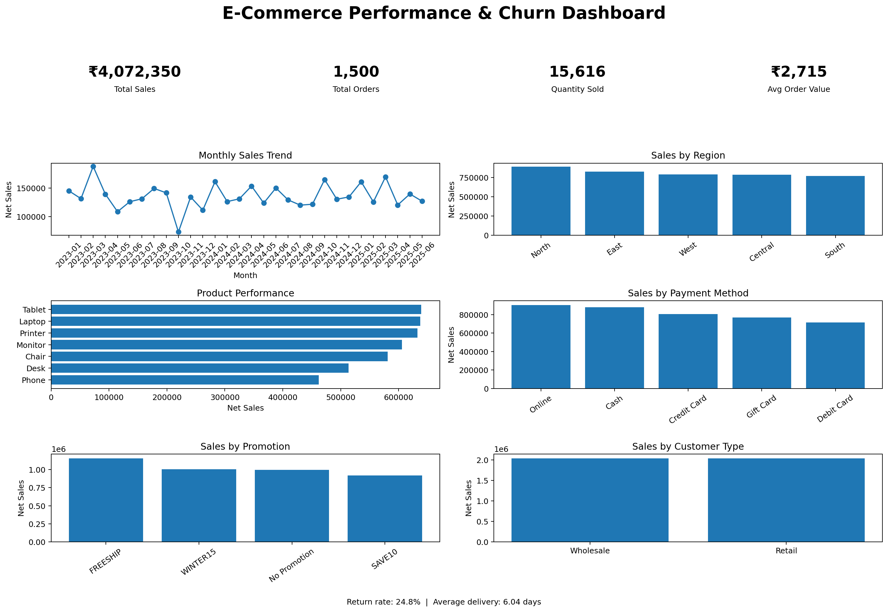

# E-Commerce Sales Analysis & Performance Dashboard

## 📊 Project Overview

This project analyzes an e-commerce sales dataset to understand sales performance, customer behavior, product performance, regional sales, promotions, payment methods, returns, and delivery performance.

The analysis was performed using Python and Pandas in Google Colab, with the final results presented through a sales performance dashboard.

## 🛠️ Tools & Technologies

- Python
- Pandas
- Matplotlib
- Microsoft Excel
- Google Colab

## 📁 Dataset

The dataset contains 1,500 e-commerce orders and 19 attributes, including:

- Order information
- Products
- Regions
- Customers
- Quantity
- Prices
- Discounts
- Promotions
- Payment methods
- Returns
- Shipping costs
- Delivery dates

## 📈 Key KPIs

| KPI | Result |
|---|---:|
| Total Sales | ₹4.07M |
| Total Orders | 1,500 |
| Quantity Sold | 15,616 |
| Average Order Value | ₹2,715 |
| Return Rate | 24.8% |
| Average Delivery Time | 6.04 days |

## 📊 Dashboard

## 🔍 Analysis Performed

The project includes analysis of:

- Monthly sales trends
- Sales by region
- Product performance
- Payment method performance
- Promotion performance
- Customer type analysis
- Return analysis
- Delivery performance

## 💡 Business Insights

The analysis provides a clear view of overall sales performance and highlights differences across products, regions, customer segments, payment methods, and promotions.

These insights can help businesses monitor KPIs and identify areas requiring further investigation.

## 📂 Project Files

- `ecommerce_analysis.ipynb` — Complete Python analysis
- `ecommerce_performance_dashboard.png` — Final dashboard
- `README.md` — Project documentation

## 👨‍💻 Author

Ismail Nafees K
